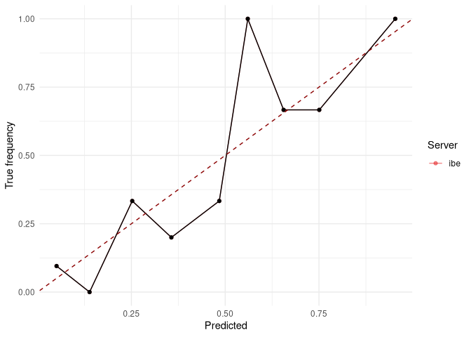

<!-- README.md is generated from README.Rmd. Please edit that file -->

# Calibration Functions for DataSHIELD

## Overview

## Installation

#### Developer version:

The package is currently hosted at a private GitLab repository. If
access is granted, the installation can be done via `devtools`:

``` r
cred = git2r::cred_user_pass(username = "username", password = "password")
devtools::install_git("https://gitlab.lrz.de/difuture_analysegruppe/ds.calibration.git", credentials = cred)
```

Note that you have to supply your username and password from GitLab to
install the package.

#### Register assign/aggregate methods

It is necessary to register the assign/aggregate methods in the OPAL
administration to use them.

**Aggregate methods:**

  - `ds.calibrate::dsBrierScore`
  - `ds.calibrate::dsCalibrationCurve`

## Usage

The following code shows the basic methods and how to use them.

``` r
library(DSI)
library(DSOpal)
library(DSLite)
library(dsBaseClient)

devtools::load_all("../ds.predict.base")
#> Loading ds.predict.base
# library(ds.calibration)

builder = DSI::newDSLoginBuilder()

builder$append(
  server   = "ibe",
  url      = "https://dsibe.ibe.med.uni-muenchen.de",
  user     = "ibe",
  password = "123456",
  table    = "ProVal.KUM"
)

logindata = builder$build()
connections = DSI::datashield.login(logins = logindata, assign = TRUE, symbol = "D", opts = list(ssl_verifyhost = 0, ssl_verifypeer=0))
#> 
#> Logging into the collaborating servers
#>   Logged in all servers [================================================================] 100% / 1s
#> 
#>   No variables have been specified. 
#>   All the variables in the table 
#>   (the whole dataset) will be assigned to R!
#> 
#> Assigning table data...
#>   Assigned all tables [==================================================================] 100% / 2s

### Get available tables:
DSI::datashield.symbols(connections)

### Test data with same structure as data on test server:
#dat   = cbind(age = sample(20:100, 100L, TRUE), height = runif(100L, 150, 220))
#probs = 1 / (1 + exp(-as.numeric(dat %*% c(-3, 1))))
#dat   = data.frame(gender = rbinom(100L, 1L, probs), dat)

dat = read.csv("data/test-kum.csv")

### Model we want to upload:
mod = glm(gender ~ age + height, family = "binomial", data = dat)

### Upload model to DataSHIELD server
pushModel(connections, mod)
#>   Assigned expr. (mod <- decodeModel("58-0a-00-00-00-03-00-04-00-00-00-03-05-00-00-00-00-05-55-54...
predictModel(connections, mod, "pred", "D", predict_fun = "predict(mod, newdata = D, type = 'response')")
#>   Assigned expr. (pred <- assignPredictModel("58-0a-00-00-00-03-00-04-00-00-00-03-05-00-00-00-00-...

DSI::datashield.symbols(connections)


### Calculate brier score:
dsBrierScore(connections, "D$gender", "pred")
#>   Aggregated (brierScore("D$gender", "pred")) [==========================================] 100% / 0s

### Calculate and plot calibration curve:
cc = dsCalibrationCurve(connections, "D$gender", "pred", 10, 3)
#>   Aggregated (calibrationCurve("D$gender", "pred", 10, 3)) [=============================] 100% / 0s
plotCalibrationCurve(cc)
#> Warning: Removed 1 rows containing missing values (geom_point).
#> Warning: Removed 1 row(s) containing missing values (geom_path).
#> Warning: Removed 1 rows containing missing values (geom_point).
#> Warning: Removed 1 row(s) containing missing values (geom_path).
```

<!-- -->
